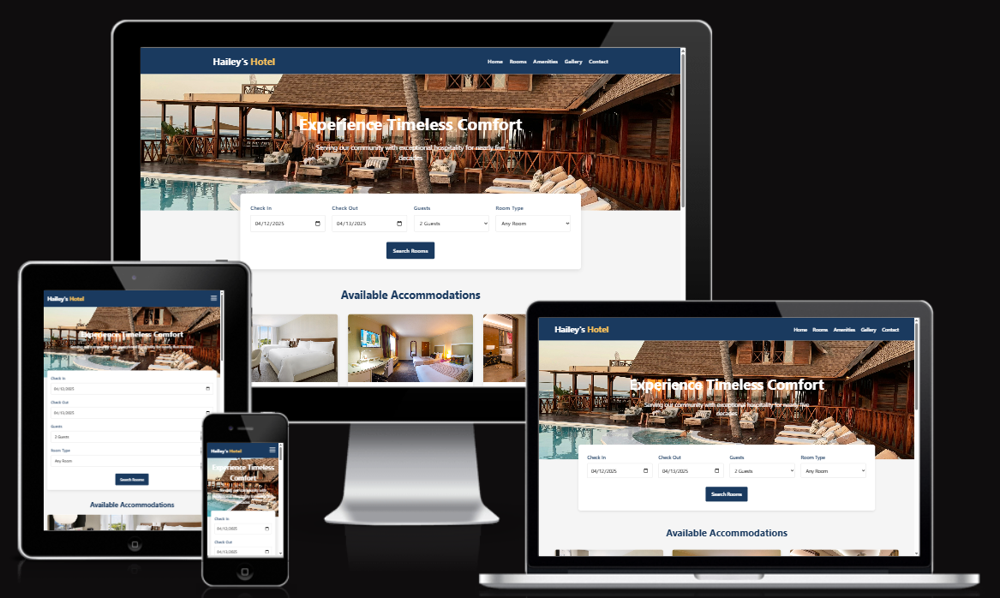

# Hailey's Hotel Website



## Project Overview

Hailey's Hotel website is a comprehensive digital platform designed to showcase our luxury accommodations and provide a seamless booking experience for potential guests. This project aims to increase online bookings, highlight the hotel's premium amenities, and establish a strong digital presence that reflects the elegance and quality of our physical locations.

## Value for Users

This website provides significant value to users by:

- **Simplified Booking Process**: Users can easily check availability and make reservations directly through the website.
- **Comprehensive Information**: Detailed descriptions and high-quality images of rooms, amenities, and services help users make informed decisions.
- **Mobile-Friendly Design**: Responsive layout ensures a seamless experience across all devices, allowing users to book on-the-go.
- **Special Offers Access**: Users can discover exclusive deals and packages available only through our website.
- **Virtual Tours**: Interactive gallery allows potential guests to explore the hotel before their stay.

## Project Structure

```
haileys-hotel/
│
├── Amenities/
│   ├── index.html       # Hotel Amenities and services
│   ├── style.css        # Primary stylesheet
│   ├── script.js        # Main Javascript functionality
├── Contact/
│   ├── index.html       # Contact information and form
│   ├── style.css        # Primary stylesheet
│   ├── script.js        # Main Javascript functionality
├── Gallery/
│   ├── index.html       # Photo gallery of the hotel
│   ├── style.css        # Primary stylesheet
│   ├── script.js        # Main javascript functionality
├── Rooms/
│   ├── index.html       # Room listing and details
│   ├── style.css        # Primary stylesheet
│   ├── script.js        # Javascript functionality


│   
          # Main homepage
├── rooms.html           # Room listings and details
├── amenities.html       # Hotel amenities and services
├── gallery.html         # Photo gallery of the hotel
├── booking.html         # Reservation system
├── contact.html         # Contact information and form

├── index.html           # Main homepage
├── rooms.html           # Room listings and details
├── amenities.html       # Hotel amenities and services
├── gallery.html         # Photo gallery of the hotel
├── booking.html         # Reservation system
├── contact.html         # Contact information and form
│
├── images/              
│   ├── Deluxe Queen Room.jpg            
│   ├── double bed.jpg           
│   ├── Executive-Suite.jpg       
│   ├── Family Room.jpg         
│   └── Hailey.jpeg          
│
└── README.md            # Project documentation
```

## Implementation Screenshots

### Homepage Hero Section


*The homepage hero section fulfills the user story: "As a potential guest, I want to see high-quality images of the hotel so that I can visualize my stay." The full-width slider showcases our most impressive hotel views with a clear call-to-action for booking.*

### Room Listings


*This section addresses the user story: "As a potential guest, I want to browse different room types with pricing information so that I can choose accommodations that fit my budget and preferences." Each room card includes images, detailed descriptions, amenities, and pricing with a direct booking button.*

### Booking System


*The booking form implements the user story: "As a potential guest, I want to check room availability for specific dates so that I can plan my stay accordingly." The form includes date selection, guest count options, and real-time availability checking.*

### Amenities Section


*This section satisfies the user story: "As a potential guest, I want to learn about the hotel's amenities so that I can determine if it meets my needs." The grid layout with icons and descriptions clearly displays all available amenities.*

### Mobile Responsiveness


*The mobile-friendly design addresses the user story: "As a mobile user, I want the website to be responsive so that I can browse and book rooms from my smartphone." All content adjusts appropriately for smaller screens while maintaining functionality.*

## External Code Attribution

### CSS Reset
```css
/* 
 * normalize.css v8.0.1
 * Source: https://necolas.github.io/normalize.css/
 * License: MIT License
 */
```

### Image Slider
```js
/*
 * Slick Carousel v1.8.1
 * Source: https://kenwheeler.github.io/slick/
 * License: MIT License
 */
```

### Date Picker for Booking
```js
/*
 * Flatpickr v4.6.9
 * Source: https://flatpickr.js.org/
 * License: MIT License
 */
```

### CSS Animations
```css
/*
 * Animate.css v4.1.1
 * Source: https://animate.style/
 * License: MIT License
 * Used for: Room card hover effects and page transitions
 */
```

## Project Requirements Implementation

### Responsive Design

The website is fully responsive across all device sizes. This was achieved through:
- Mobile-first CSS approach
- Flexible grid layouts using CSS Grid and Flexbox
- Media queries for specific breakpoints
- Responsive typography with relative units
- Touch-friendly UI elements for mobile users

### Performance Optimization

Performance was a priority throughout development:
- Optimized images with appropriate dimensions and compression
- Minified CSS and JavaScript files
- Lazy loading for images below the fold
- Limited use of external libraries to reduce load time
- Browser caching implemented for static assets

### Accessibility Considerations

The website follows WCAG 2.1 guidelines:
- Semantic HTML elements throughout
- Proper heading hierarchy (h1-h6)
- ARIA attributes where appropriate
- Color contrast ratios meeting AA standards
- Keyboard navigation support
- Alt text for all images

## Development Process

The development process followed these key steps:
1. Requirements gathering and user story development
2. Wireframing and design mockups
3. HTML structure implementation
4. CSS styling and responsive design
5. JavaScript functionality integration
6. Testing across devices and browsers
7. Performance optimization
8. Deployment

## Git Version Control

This project used Git for version control with regular, meaningful commits:
```
git init
git add README.md
git commit -m "Initial project setup with README"
git add index.html css/reset.css
git commit -m "Add homepage structure and CSS reset"
git add css/main.css
git commit -m "Implement responsive header and navigation"
```

## Future Enhancements

Planned future enhancements include:
- Integration with a real-time booking API
- Multi-language support
- Virtual reality room tours
- Guest review system
- Loyalty program integration

---

© 2025 Hailey's Hotel. All Rights Reserved.